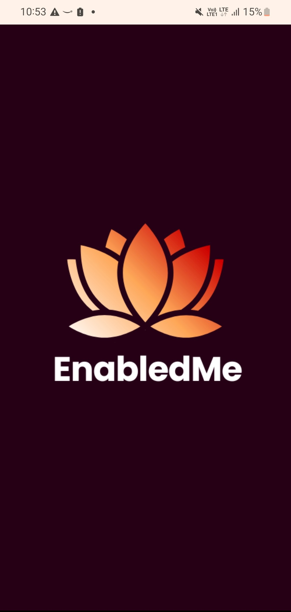
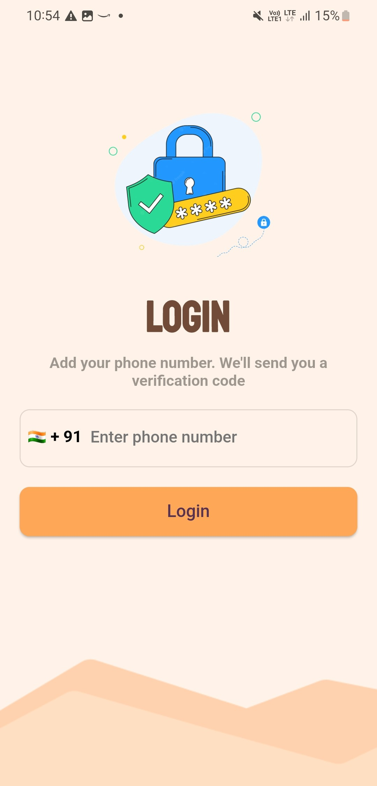
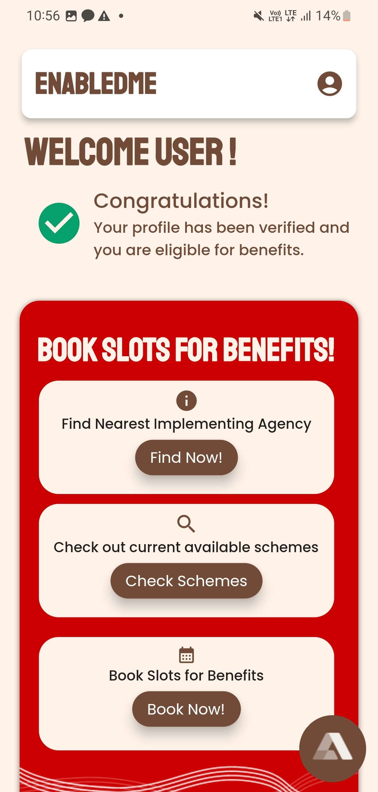
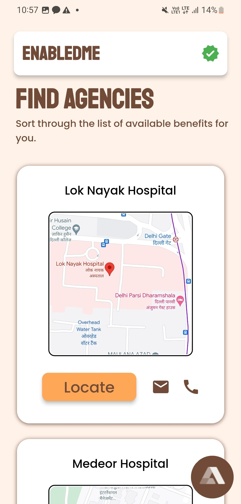
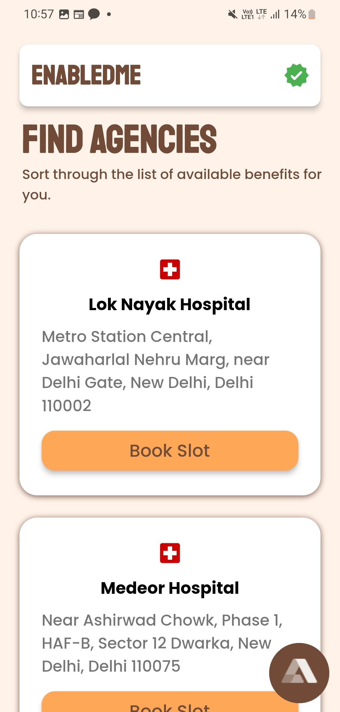
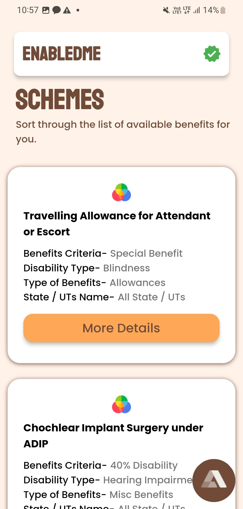

# EnabledMe

Our purpose is to empower people with disabilities by providing them with a unique identity and enabling them to access welfare schemes through a user-friendly platform. Our goal is to promote inclusion, equality, and social justice by bridging the gap between people with disabilities and the resources available to them.
People with disabilities are often faced with discrimination and social stigma that can lead to a lack of identity and recognition in the society. By providing them with a unique identity, we aim to acknowledge and validate their existence, recognizing them as one of our own.
There are many government and non-government programs in place to support the community and new schemes are always being introduced but people with disabilities face multiple barriers in accessing these schemes, such as lack of awareness, documentation, and accessibility issues. By providing a user-friendly platform, we will make it easier for people with disabilities to access the benefits they are entitled to.

## Features

- Phone Authentication which is better in comparision to email authentication because of its higher engagement rates and security also it is more reliable.
- AI Voice Assistant which helps in assiting people with disability at every step.
- Explore various Hospitals and Agencies providing aid for disabled people.
- Explore various Schemes introduced by government for disabled people.

## User Interface

<table>
  <tr>
    <td>Logo</td>
     <td>Login Page</td>
     <td>Welcome Page</td>
  </tr>
  <tr>
    <td></td>
    <td></td>
    <td></td>
  </tr>
 </table>
 <table>
  <tr>
    <td>Find Agencies Page</td>
     <td>Sort Agencies Page</td>
     <td>Schemes Page</td>
  </tr>
  <tr>
    <td></td>
    <td></td>
    <td></td>
  </tr>
 </table>

## Documentation

[Figma Design](https://www.figma.com/file/oYBwbQey2I6iclbLW8jJMa/ADIP-Yojna?node-id=226-3769)

## Tech Stack

**Frontend:** Flutter

**Backend:** Firebase

**Technologies:** Firebase, NoSql, AI Voice Assistant

**Programming Languages:** Dart

**Tools:** Android Studio, VsCode, Git Bash, Git Hub
## Authors

- [@ArpitTripathi945](https://www.github.com/ArpitTripathi945)
- [@AasthaCodex](https://www.github.com/AasthaCodex)
- [@ArthrowAbstract](https://www.github.com/ArthrowAbstract)
- [@Aabhya01](https://www.github.com/Aabhya01)

## License

[MIT](https://choosealicense.com/licenses/mit/)

